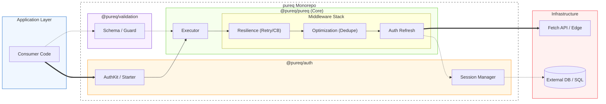

# pureq

## System Architecture



pureq is a policy-first TypeScript ecosystem for transport and authentication.

This repository contains:

- a functional, immutable, and type-safe HTTP transport core
- an explicit, framework-neutral authentication and session layer
- a policy-aware validation layer for structured parsing, guardrails, and redaction

## Core Philosophy

pureq is built around one principle:

Policy should be explicit, composable, and testable.

In practice this means:

- immutable composition over mutable global configuration
- failures modeled as values, not hidden control flow
- runtime behavior expressed as reusable policy layers
- security and operations treated as first-class design constraints

## Packages

### @pureq/pureq

Policy-first HTTP transport for frontend, backend, BFF, and edge runtimes.

Main characteristics:

- immutable client composition
- onion-model middleware
- strict path and request typing
- result-style error handling
- zero runtime dependencies
- observability-friendly lifecycle hooks

Docs:

- [Package Docs Index](https://github.com/shiro-shihi/pureq/blob/main/packages/pureq/docs/README.md)
- [Getting Started](https://github.com/shiro-shihi/pureq/blob/main/packages/pureq/docs/getting_started.md)

### @pureq/auth

Framework-neutral auth/session layer for secure, explicit auth operations.

Main characteristics:

- createAuthKit and createAuthStarter onboarding paths
- provider presets and OIDC callback contracts
- SQL adapters with readiness assessment
- explicit CSRF and revocation controls
- migration diagnostics and cutover playbooks
- framework packs for Next.js, Express, Fastify, and React bootstrap

Docs:

- [Package README](https://github.com/shiro-shihi/pureq/blob/main/packages/auth/README.md)
- [Package Docs Index](https://github.com/shiro-shihi/pureq/blob/main/packages/auth/docs/README.md)

### @pureq/validation

Policy-aware validation and serialization primitives for explicit data contracts.

Main characteristics:

- zero-throw `Result`-based parsing
- policy metadata propagation through `ValidationResult`
- RFC 6901 JSON Pointer paths for field-level policy maps
- guardrail chaining with sync and async support
- policy-aware redaction and scope-based output control

Docs:

- [Package README](https://github.com/shiro-shihi/pureq/blob/main/packages/validation/README.md)
- [Implementation Plan](https://github.com/shiro-shihi/pureq/blob/main/packages/validation/docs/Implementation_plan.md)
- [Release Notes](https://github.com/shiro-shihi/pureq/blob/main/packages/validation/docs/release-notes-v0.1.0-draft.md)

## Why pureq

pureq is aimed at teams that want:

- clear policy boundaries between business logic and runtime behavior
- reliable transport and auth flows across multiple runtimes
- measurable migration and release decisions
- operationally visible defaults rather than hidden framework magic

## Quick Examples

### Transport example

```ts
import { createClient, retry, circuitBreaker, dedupe } from "@pureq/pureq";

const api = createClient({ baseURL: "https://api.example.com" })
  .use(dedupe())
  .use(retry({ maxRetries: 2, delay: 200 }))
  .use(circuitBreaker({ failureThreshold: 5, cooldownMs: 30_000 }));
```

### Auth example

```ts
import { createAuthStarter, createInMemoryAdapter } from "@pureq/auth";

const starter = await createAuthStarter({
  security: { mode: "ssr-bff" },
  adapter: createInMemoryAdapter(),
});
```

## Repository Docs

- [Transport Docs](https://github.com/shiro-shihi/pureq/blob/main/packages/pureq/docs/README.md)
- [Auth Docs](https://github.com/shiro-shihi/pureq/blob/main/packages/auth/docs/README.md)
- [Auth Implementation Plan](https://github.com/shiro-shihi/pureq/blob/main/packages/auth/plan.md)
- [Validation README](https://github.com/shiro-shihi/pureq/blob/main/packages/validation/README.md)
- [Validation Release Notes](https://github.com/shiro-shihi/pureq/blob/main/packages/validation/docs/release-notes-v0.1.0-draft.md)

## Installation

Install the package you need:

```bash
pnpm add @pureq/pureq
pnpm add @pureq/auth
pnpm add @pureq/validation
```

## License

MIT © Shihiro
